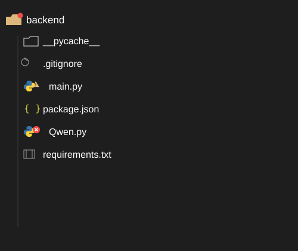
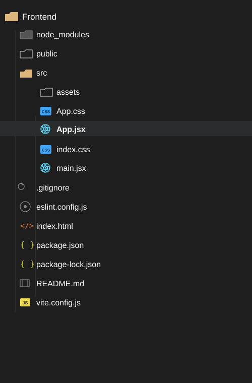
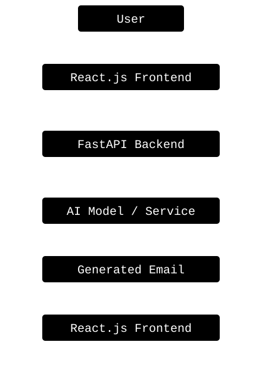

# ✉️ AI Email Writer

An AI-powered email generation web application that helps users quickly create professional, well-structured emails using artificial intelligence.
The application is built with a **React.js frontend** and a **FastAPI backend**, providing a clean user interface and a REST API for email generation.
The main selling point of this project is the usage of the local AI model for writing well structured E-Mails. For this project, Qwen-2.5-1,5B-Instruct 
HuggingFace AI Model is used.

## 🚀 Features

* ✨ Generate professional emails using AI
* 📝 Create emails based on a simple prompt
* 🎨 Clean and responsive React.js interface
* ⚡ FastAPI backend with REST API
* 🔗 Seamless frontend-backend integration
* 🐍 Python-based backend
* 💻 Modern JavaScript frontend

## 🛠️ Tech Stack

* React.js
* JavaScript
* HTML/CSS
* Python
* FastAPI
* Uvicorn
* HuggingFace Spaces
* Vercel

## 📁 Project Structure

<p align="center">
  
   
</p>

## ⚙️ Installation & Setup

### 1. Clone the Repository

```bash
git clone https://github.com/laksh-ahuja06/AI-email-writer.git
cd AI-email-writer
```

### 2. Set Up the Backend

Navigate to the backend directory:

```bash
cd backend
```

Install the required Python dependencies:

```bash
pip install -r requirements.txt
```

Start the FastAPI development server:

```bash
uvicorn main:app --reload
```

The backend will typically be available at:

```text
http://127.0.0.1:8000
```

FastAPI also provides interactive API documentation at:

```text
http://127.0.0.1:8000/docs
```

### 3. Set Up the Frontend

Open a new terminal and navigate to the frontend directory:

```bash
cd frontend
```

Install the required npm packages:

```bash
npm install
```

Start the development server:

```bash
npm run dev
```

The frontend will be available at the URL displayed in your terminal, typically:

```text
http://localhost:5173
```


## 💡 How It Works

The application follows a simple request flow:

<p align="center">
  
</p>

1. The user enters a prompt or describes the email they want to write.
2. The React frontend sends the request to the FastAPI backend.
3. The backend processes the request and communicates with the AI service.
4. The generated email is returned through the REST API.
5. The frontend displays the generated email to the user.

## 🔌 API

The backend is powered by FastAPI and exposes REST API endpoints for communicating with the frontend.

Once the backend is running, you can explore the available endpoints using the automatically generated Swagger documentation:

```text
http://127.0.0.1:8000/docs
```

You can also view the ReDoc documentation at:

```text
http://127.0.0.1:8000/redoc
```

> The exact API endpoints depend on the implementation in `backend/main.py`.

## 🖥️ Usage

After starting both the backend and frontend:

1. Open the frontend application in your browser.
2. Enter a description of the email you want to generate.
3. Submit your request.
4. The application sends the prompt to the backend.
5. Review the AI-generated email.
6. Copy or use the generated email as needed.

## 🧪 Development

For local development, run the backend and frontend in separate terminals.

**Terminal 1 — Backend**

```bash
cd backend
uvicorn main:app --reload
```

**Terminal 2 — Frontend**

```bash
cd frontend
npm run dev
```

Changes made to the frontend or backend will be reflected during development through the respective development servers.

## 🤝 Contributing

1. Contributions are welcomed! First fork the repository.
2. Then, create a new branch:

```bash
git checkout -b feature/your-feature
```

3. Make your changes.
4. Commit your changes:

```bash
git commit -m "Add your feature"
```

5. Push the branch:

```bash
git push origin feature/your-feature
```

6. Open a Pull Request.

